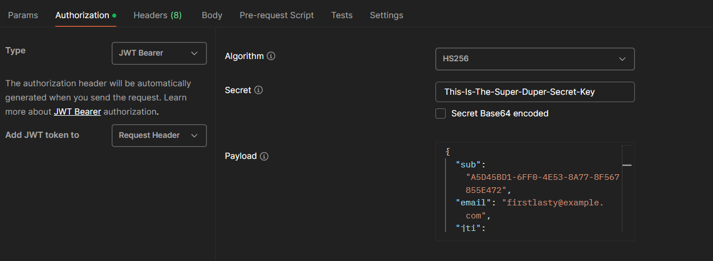

# Consilium Tempus Backend API

To use the application and access its API endpoints, you will need a valid JWT token 
to be authenticated and get authorization.

* [Api Controller](#api-controller)
* [Authentication](#authentication)
* [Authorization](#authorization)
* [Controllers](#controllers)
* [Dto](#dto)

## Api Controller

Inside the code you will find an Api Controller **class**, under the _Controllers_ package. 
This class implements basic functionality for all the controllers that are and will be created in the project. 
It is intended to be extended by all the controllers (Template Design Pattern).

The template Api Controller resolves the following:
- it sets the RESTful Api route to `{{controller}}s` to sub controllers, 
where **controller** is the name of the controller 
(i.e., for a User Controller the route would be `{{host}}/api/users` <<**Notice** the api prefix>>)
- it seeks authentication via a token by default (see below for a valid token),
otherwise the user should make use of the *Allow Anonymous* attribute
- it injects the mapper and the mediator
- it contains a solution for returning validation problems, conflicts, etc.

## Authentication

The developer shall provide a token for endpoints that do not allow anonymous requests.
One way to add one inside Postman is to go to the *Authorization* tab and under the type *JWT Bearer* add the following:
- **Secret Key**, defined in the [Get Started](../README.md/#dotnet-user-secrets) chapter 
- and **Payload** which should include the following:
  - **sub**, the user id of an existing user
  - **email** of the user
  - **jti**, the id of the token
  - **exp**, the expiration date in ms
  - **iss** (Issuer) of the application (can be found in the Jwt Settings inside the `appsettings.json`)
  - **aud** (Audience) of the application (can be found in the Jwt Settings inside the `appsettings.json`)

**NOTICE**: The claims are case-sensitive, therefore, they should match with the database data 
(except for **sub** and **jti**).

An example can be found below: 
(for a better view of the payload check the Api Auth [documentation](api/Api.Auth.md/#auth))

## Authorization

To add authorization for each endpoint, 
use the **Has Permission** Attribute in combination with the **Permissions** Enum from the [Domain](Domain.md/#enums).

## Controllers

Typically, each controller will extend the Api Controller, 
have a route similar to its name and have the methods in the following order:
- **Get** Requests
- **Post** Requests
- **Put** Requests
- **Delete** Requests

Below, you will find complete documentation on each Controller of the Api Layer:
- [Authentication](api/Api.Auth.md)
- [Project](api/Api.Project.md)
- [Project Sprint](api/Api.ProjectSprint.md)
- [User](api/Api.User.md)
- [Workspace](api/Api.Workspace.md)