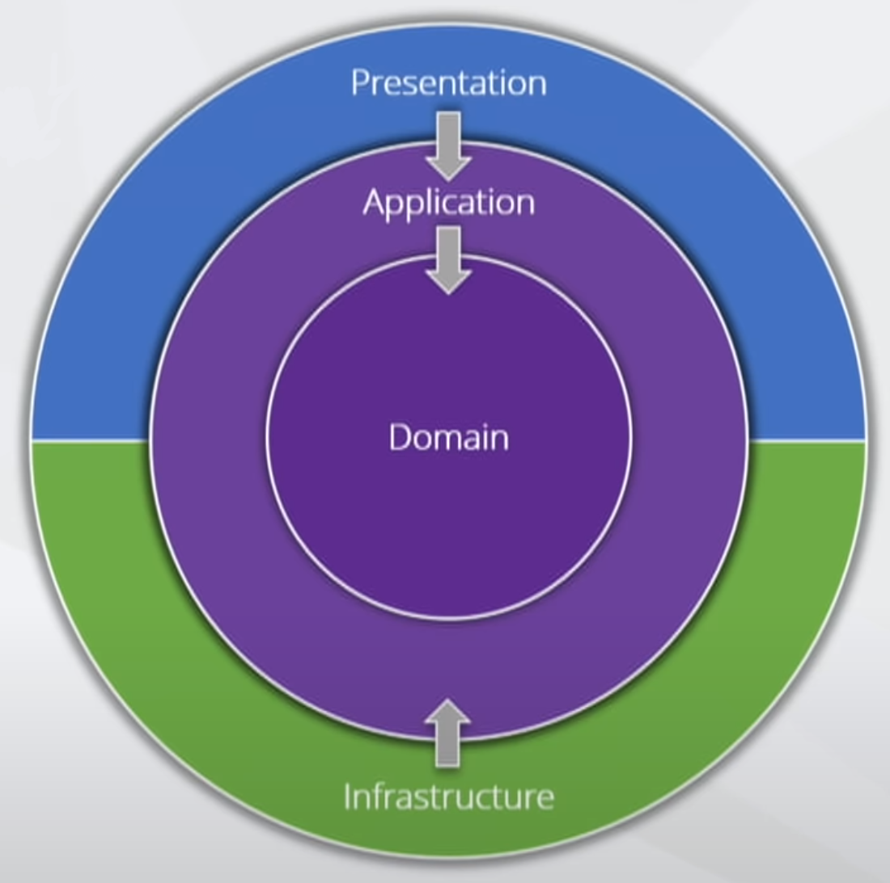

# Consilium Tempus Backend Architecture

The Application Architecture thrives to be written in **Clean Architecture**, 
which is a software design philosophy that separates the elements of a design into ring levels. 
An important goal of clean architecture is 
to provide developers with a way 
to organize code in such a way that it encapsulates the business logic 
but keeps it separate from the delivery mechanism. 
A primordial design implemented by the application would be the Domain Driven Design. 

**Domain-Driven Design (DDD)** 
is a collection of principles and patterns that help developers craft elegant object systems. 
Properly applied, it can lead to software abstractions called domain models. 
These models encapsulate complex business logic, closing the gap between business reality and code. 
One of the main points would be 
to provide a reusable solution independent of any changes in the database or presentation layer (i.e., REST, GraphQL). 
 
The four layers of this type of architecture feature the:
- [Domain Layer](#domain-layer)
- [Infrastructure Layer](#infrastructure-layer)
- [Application Layer](#application-layer)
- [Presentation Layer](#presentation-layer---api)

## Domain Layer

This is the core of the application, where all the domain models, their business logic and errors/exceptions reside.

An **Aggregate** represents each domain business model. 
An aggregate is a group of business objects that always needs to be consistent. 
Therefore, we save and update aggregates as a whole inside a transaction. 
Each aggregate has an Aggregate Root that has an Id. 
Some models will also have entities inside.

**Entities** are objects that are equal only if their ID is equal. 
The Ids are usually represented by **Value Objects**. 
Those are objects that are equal if all their values are equal.

This Layer also implements the **Error Or** Library, 
so that inside the Application Layer errors can be returned instead of models, or command results.

More about the domain models can be found at [Domain Models](./Domain.md).

## Infrastructure Layer

The Infrastructure layer is responsible to communicate with external components, such as a database, 
maintain the workflow and process data. 
Inside this layer, the database gets configured, 
implementing the **ORM** Pattern by using the **Entity Framework Core**. 
To be noted, that the same package is used to configure the database columns, indexes, etc., 
before the domain model enters or leaves the database. 
For example, if the item contains an Id value object, 
then inside the database only the Value from within the value object will be taken and vice versa
when the data comes from the database inside the app.
The database calls are managed by using the **Repository Pattern** which is revolving around the Domain Aggregates.

Furthermore, inside the infrastructure the **Jwt Token** gets created 
based on the jwt settings parsed inside the Api Layer on the `apssettings.json` 
whilst using the Secret Key for Symmetric Cryptography.

Moreover, this layer is responsible for creating the passwords' hash as well. 
The process is done using the **BCrypt** Algorithm. 
This Algorithm also generates a _salt_ and applies a _work factor_ on it, 
so that two passwords can never have the same hash.

## Application Layer

It resides in the middle of the Domain and Presentation Layers, and it is independent of the Infrastructure Layer.

The Application Layer implements the **CQRS Pattern** (Command and Query Responsibility Segregation), 
which separates the read and update operations for data storage. 
Those commands or queries are sent by the Presentation Layer (Api) through _MediatR_. 

To provide independence from the Infrastructure Layer, the application implements the **Inversion of Control Pattern**, 
as it abstracts all the logic by using interfaces (in favor of composition). 
Furthermore, it also implements the **repository** and **unit of work** patterns, 
which are intended to create an abstraction layer between the infrastructure layer and the application layer. 
Implementing these patterns helps insulate the application from changes in the data store
and facilitate automated unit testing. 

Before handling any request, it does server-side validation on all the properties of the command or query received. 
This goal is achieved using the _Fluent Validation_ and a _Pipeline Behavior_ (provided by MediatR), 
that searches at runtime through the Assembly for a validator 
and translates all the errors from the Validation to our Domain Errors.

## Presentation Layer—Api

This layer represents the interface code, or it could be implied that it is the "gate" to the outside world,
as it brings exposure to the application from the network.
One method to achieve this kind of disclosure is REST;
therefore, the presentation layer of this application is represented by a REST Api that listens for requests.

The main operations that this layer performs after receiving a request are:
- map the request to a command by using _Mapster_
- send the command to the application layer through _MediatR_ and wait for a result
- finally, the result is either mapped to a response and sent back with 200 status code to the user, 
- or an error is mapped appropriately to the corresponding status code and sent back in RFC Format.

In conclusion, all **requests** have a mapping configuration to a specific application layer *command* or *query*, 
and all the application layer *results* map to an api layer **response**. 
Also, to be noted that all the mapping configurations are injected on runtime via the executing assembly.

More about the Api and the HTTP Requests and Response can be found at [Api documentation](Api.md).