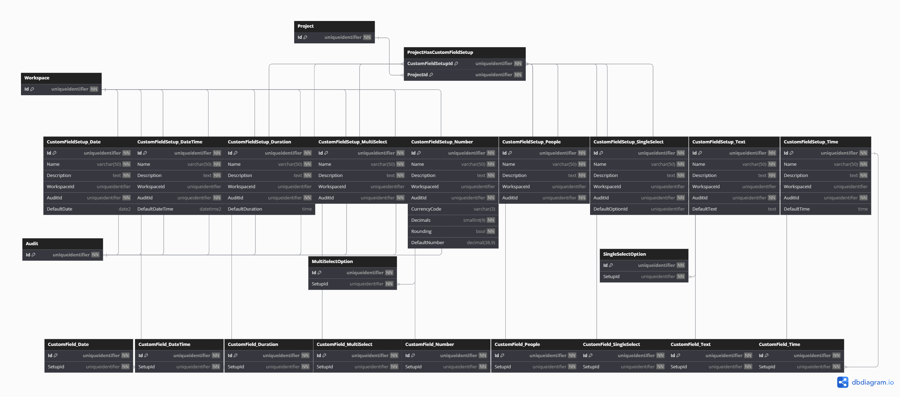

# Database Diagrams

## Custom Field Setup

### Relationships

- **One-to-One** relationship with the [Audit](../../domain/entities/Entity.Audit.md) entity.
- **One-to-Many** relationship with the [Workspace](../../domain/aggregates/Aggregate.Workspace.md) aggregate.
- **Many-to-Many** relationship with the [Project](../../domain/aggregates/Aggregate.Project.md) aggregate.
(via the *ProjectHasCustomFieldSetup* entity)
- **Many-to-One** relationship with the [Custom Field](../../domain/entities/project-task/Entity.CustomField.md) entity.

#### Variants

##### Multi Select

- **Many-to-One** relationship with the [Multi Select Option](../../domain/entities/Entity.MultiSelectOption.md) entity.

##### Single Select

- **Many-to-One** relationship with the [Single Select Option](../../domain/entities/Entity.SingleSelectOption.md) entity.

### Diagram

