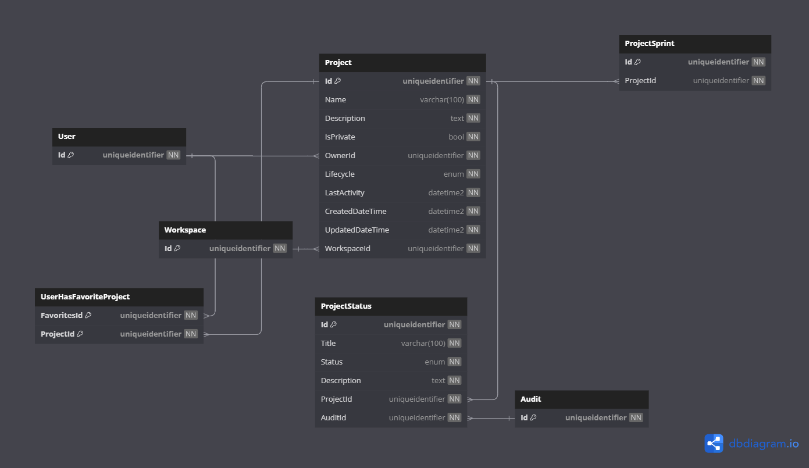

# Database Diagrams

## Project

### Relationships

- **Many-to-one** relationship with the [Workspace](../../domain/aggregates/Aggregate.Workspace.md) aggregate.
- **Many-to-one** relationship with the [User](../../domain/aggregates/Aggregate.User.md) aggregate.
- **Many-to-many** relationship with the [User](../../domain/aggregates/Aggregate.User.md) aggregate
(through the **UserHasFavoriteProject** entity).
- **One-to-Many** relationship with the [Project Status](../../domain/entities/project/Entity.ProjectStatus.md) entity.
- **One-to-Many** relationship with the [Project Sprint](../../domain/aggregates/Aggregate.ProjectSprint.md) entity.

### Diagram

