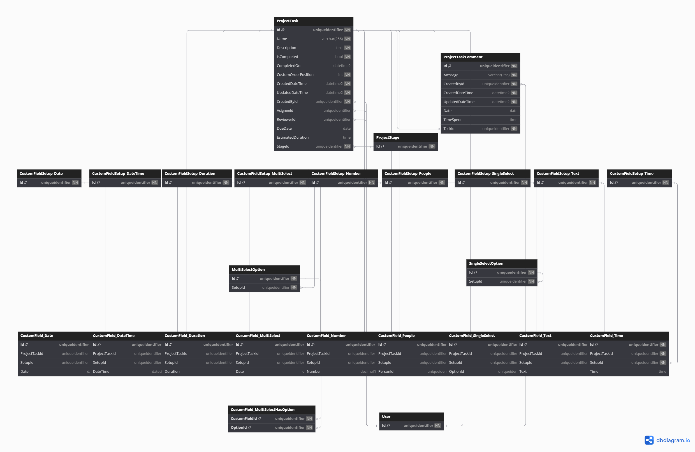

# Database Diagrams

## Project Task

### Relationships

- **Many-to-one** relationship with the [Project Stage](../../domain/entities/project-sprint/Entity.ProjectStage.md) entity.
- **One-to-Many** relationship with the [Project Task Comment](../../domain/entities/project-task/Entity.ProjectTaskComment.md) entity.
- Three **Many-to-one** relationships with the [User](../../domain/aggregates/Aggregate.User.md) aggregate.

### Owned Entities Relationships

#### Project Task Comment

- **Many-to-one** relationships with the [User](../../domain/aggregates/Aggregate.User.md) aggregate.

#### Custom Field

- **Many-to-one** relationship with the [Custom Field Setup](../../domain/aggregates/Aggregate.CustomFieldSetup.md) aggregate.

##### Variants

###### Multi Select

- **Many-to-Many** relationship with the [Multi Select Option](../../domain/entities/Entity.MultiSelectOption.md) entity
(via the *CustomField_MultiSelectHasOption* entity).

###### People

- **Many-to-One** relationship with the [User](../../domain/aggregate/Aggregate.User.md) aggregate.

###### Single Select

- **One-to-Many** relationship with the [Single Select Option](../../domain/entities/Entity.SingleSelectOption.md) entity.

### Diagram

