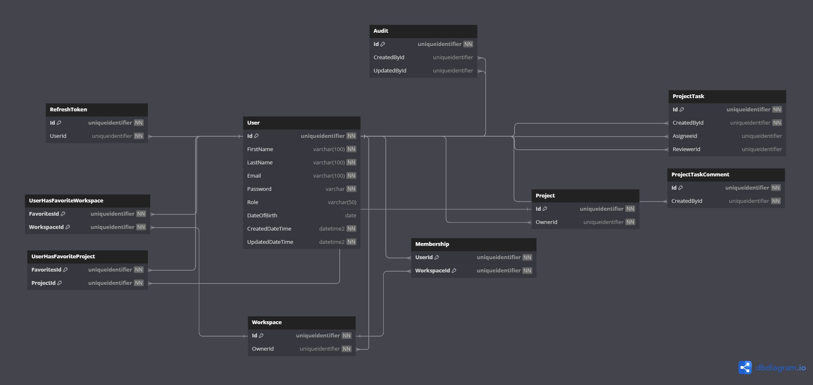

# Database Diagrams

## User

### Relationships

- **Many-to-many** relationship with the [Workspace](../../domain/aggregates/Aggregate.Workspace.md) aggregate
(through the **Many-to-one** relationship with the [Membership](../../domain/entities/Entity.Membership.md) entity).
- **Many-to-many** relationship with the [Workspace](../../domain/aggregates/Aggregate.Workspace.md) aggregate
(through the **UserHasFavoriteWorkspace**).
- **Many-to-many** relationship with the [Project](../../domain/aggregates/Aggregate.Project.md) aggregate
(through the **UserHasFavoriteProject**).
- **One-to-many** relationship with the [Refresh Token](../../domain/entities/Entity.RefreshToken.md) entity.
- **One-to-many** relationship with the [Audit](../../domain/entities/Entity.Audit.md) entity.
- **One-to-many** relationship with the [Workspace](../../domain/aggregates/Aggregate.Workspace.md) aggregate.
- **One-to-many** relationship with the [Project](../../domain/aggregates/Aggregate.Project.md) aggregate.
- 3x **One-to-many** relationships with the [Project Task](../../domain/aggregates/Aggregate.ProjectTask.md) aggregate.
- **One-to-many** relationship with the [Project Task Comment](../../domain/entities/project-task/Entity.ProjectTaskComment.md) entity.

### Diagram

