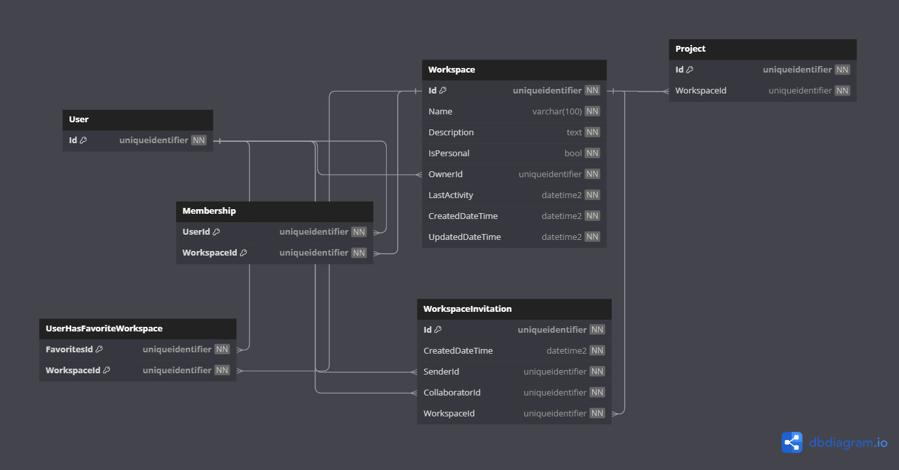

# Database Diagrams

## Workspace

### Relationships

- **Many-to-many** relationship with the [User](../../domain/aggregates/Aggregate.User.md) aggregate.
(through the **Many-to-one** relationship with the [Membership](../../domain/entities/Entity.Membership.md) entity).
- **Many-to-many** relationship with the [User](../../domain/aggregates/Aggregate.User.md) aggregate.
  (through the **UserHasFavoriteWorkspace** entity).
- **Many-to-one** relationship with the [User](../../domain/aggregates/Aggregate.User.md) aggregate.
- **One-to-Many** relationship with the [Project](../../domain/aggregates/Aggregate.Project.md) aggregate.
- **One-to-Many** relationship with the [Workspace Invitation](../../domain/entities/workspace/Entity.WorkspaceInvitation.md) entity.

### Owned Entities Relationships

#### Workspace Invitation

- 2x **Many-to-one** relationships with the [User](../../domain/aggregates/Aggregate.User.md) aggregate.

### Diagram

