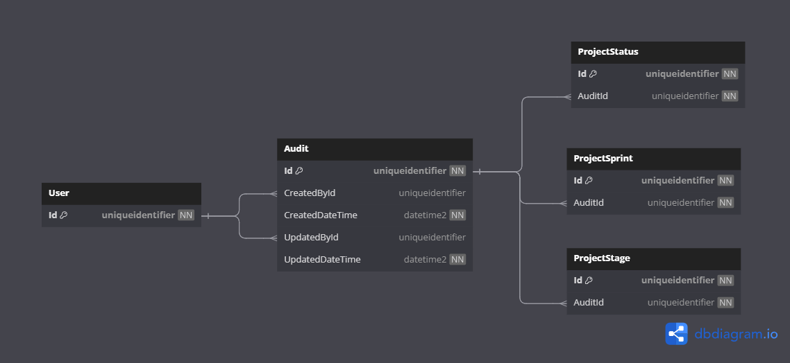

# Database Diagrams

## Audit

### Relationships

- 2x **Many-to-One** relationships with the [User](../../domain/aggregates/Aggregate.User.md) aggregate.
- **One-to-many** relationship with the [Project Status](../../domain/entities/project/Entity.ProjectStatus.md) entity.

### Diagram

