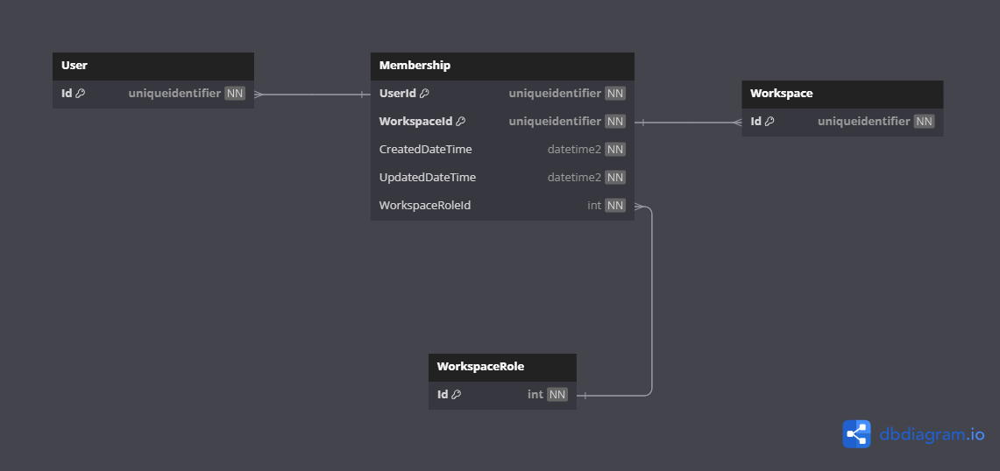

# Database Diagrams

## Membership

### Relationships

- **One-to-many** relationship with the [User](../../domain/aggregates/Aggregate.User.md) aggregate.
- **One-to-many** relationship with the [Workspace](../../domain/aggregates/Aggregate.Workspace.md) aggregate.
- **One-to-many** relationship with the [Workspace Role](../../domain/entities/Entity.WorkspaceRole.md) entity.

### Diagram

