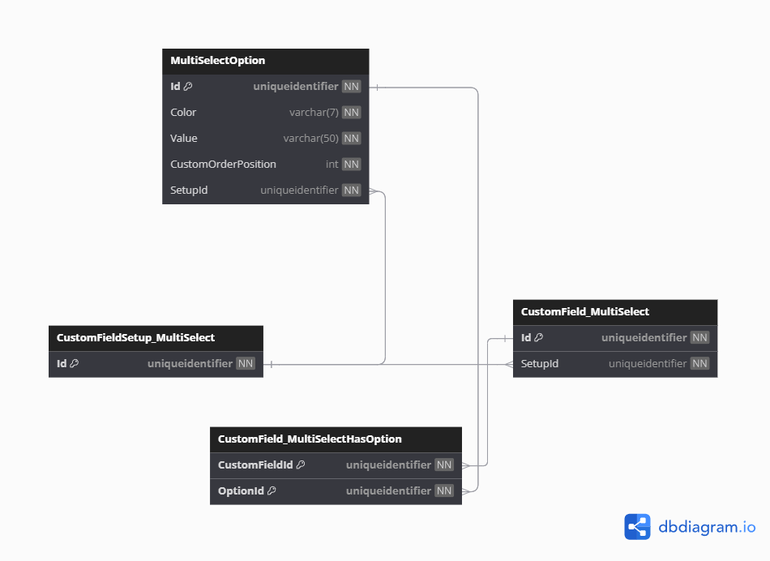

# Database Diagrams

## Multi Select Option

### Relationships

- **Many-to-Many** relationship with the [Custom Field Multi Select](../../domain/entities/project-task/Entity.CustomField.md) entity
(via the *CustomField_MultiSelectHasOption* entity).
- **Many-to-One** relationship with the [Custom Field Setup Multi Select](../../domain/aggregates/Aggregate.CustomFieldSetup.md) aggregate.

### Diagram

