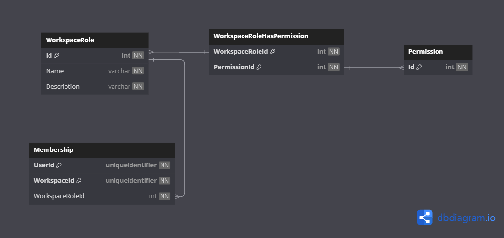

# Database Diagrams

## Workspace Role

### Relationships

- **Many-to-many** relationship with the [Permission](../../domain/entities/Entity.Permission.md) entity.
- **One-to-Many** relationship with the [Membership](../../domain/entities/Entity.Membership.md) entity.

### Diagram

