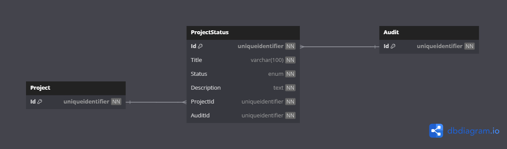

# Database Diagrams

## Project Status

### Relationships

- **Many-to-one** relationship with the [Project](../../../domain/aggregates/Aggregate.ProjectSprint.md) aggregate.
- **Many-to-one** relationship with the [Audit](../../../domain/entities/Entity.Audit.md) entity.

### Diagram

