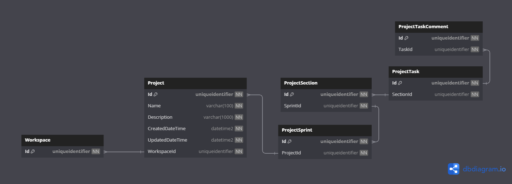

# Database Diagrams

## Project

### Relationships

- **Many-to-one** relationship with the [Workspace](../../aggregates/Aggregate.Workspace.md) aggregate.
- **One-to-Many** relationship with the [Project Sprint](../../entities/project/Entity.ProjectSprint.md) entity.
  - The Sprint has a **One-to-Many** relationship with the 
    [Project Stage](../../entities/project/Entity.ProjectStage.md) entity.
    - The Section has a **One-to-Many** relationship with the
      [Project Task](../../aggregates/Aggregate.ProjectTask) aggregate.

### Diagram

