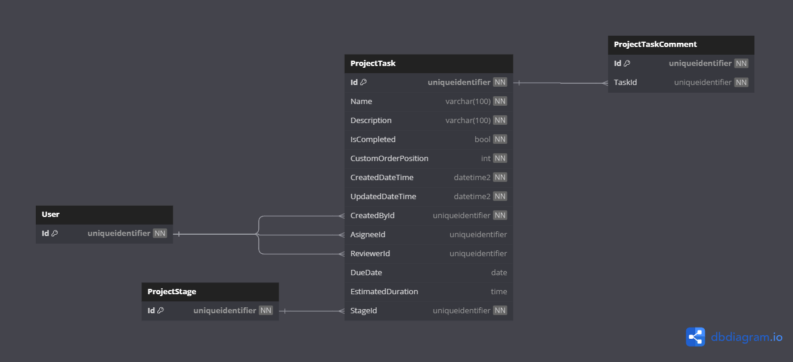

# Database Diagrams

## Project Task

### Relationships

- **Many-to-one** relationship with the [Project Section](../../entities/project/Entity.ProjectSection.md) entity.
- Three **Many-to-one** relationships with the [User](../../aggregates/Aggregate.User.md) aggregate.
- **One-to-Many** relationship with the [Project Task Comment](../../entities/project-task/Entity.ProjectTaskComment.md) entity.

### Diagram

