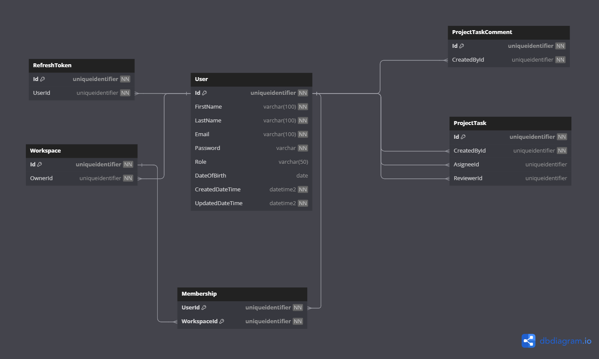

# Database Diagrams

## User

### Relationships

- **Many-to-many** relationship with the [Workspace](../../aggregates/Aggregate.Workspace.md) aggregate
(through the **Many-to-one** relationship with the [Membership](../../entities/Entity.Membership.md) entity).

### Diagram

