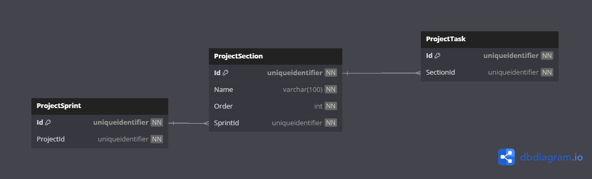

# Database Diagrams

## Project Section

### Relationships

- **Many-to-one** relationship with the [Project Sprint](../../../entities/project/Entity.ProjectSprint.md) entity.
- **One-to-many** relationship with the [Project Task](../../../entities/project/Entity.ProjectTask.md) entity.

### Diagram

