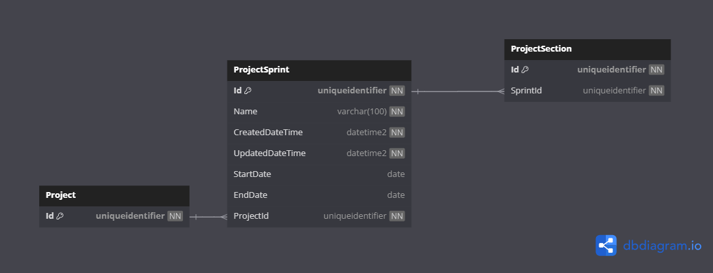

# Database Diagrams

## Project Sprint

### Relationships

- **Many-to-one** relationship with the [Project](../../../aggregates/Aggregate.Project.md) aggregate.
- **One-to-many** relationship with the [Project Stage](../../../entities/project/Entity.ProjectStage.md) entity.

### Diagram

