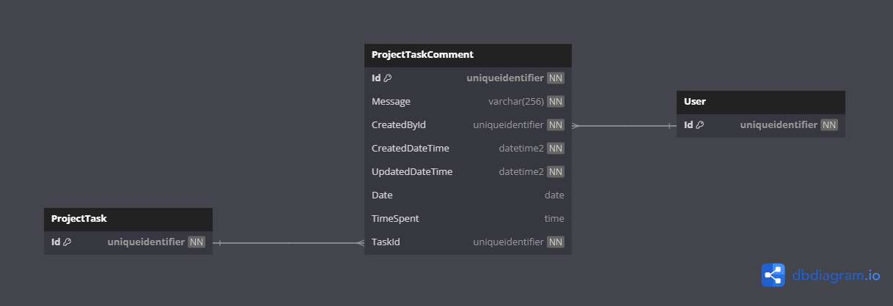

# Database Diagrams

## Project Task Comment

### Relationships

- **Many-to-one** relationship with the [Project Task](../../../entities/project/Entity.ProjectTask.md) aggregate.
- **Many-to-one** relationship with the [User](../../../aggregates/Aggregate.User.md) aggregate.

### Diagram

